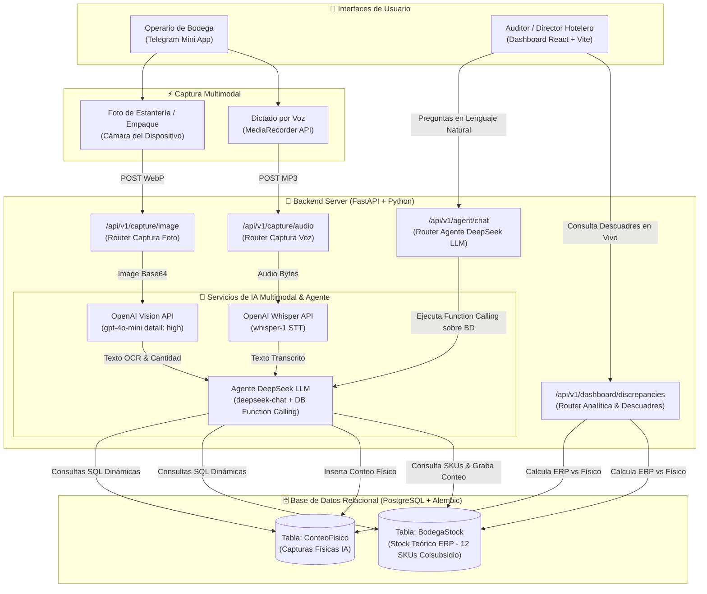

# Invictory_AI - Reto de Hotelería (Hackathon Colsubsidio x 30X)

**Invictory_AI** es una solución MVP de nivel empresarial diseñada para eliminar la captura manual de inventarios en almacenes y bodegas de hotelería mediante agentes de inteligencia artificial multimodal (**OpenAI Whisper** para voz, **OpenAI Vision `detail: high`** para OCR y **DeepSeek LLM `deepseek-chat`** con *Function Calling* sobre PostgreSQL).

---

## 📐 Diagrama de Arquitectura del Sistema (Mermaid)

El siguiente diagrama ilustra el flujo completo de información desde los operarios en la Telegram Mini App y auditores en el Dashboard React hasta el procesamiento multimodal por la IA y la persistencia en PostgreSQL:



---

## ⚡ Características Principales

1. **Captura por Voz (Speech-to-Text):** Operarios dictan conteos físicos mediante la **Telegram Mini App**, procesados por `whisper-1` de OpenAI y estructurados por **DeepSeek LLM**.
2. **Captura por Imagen (OCR detail=high):** Lectura e identificación de empaques y etiquetas de insumos procesada por OpenAI Vision (`gpt-4o-mini` con `detail: high`).
3. **Agente Inteligente DeepSeek con Function Calling (`/api/v1/agent/chat`):** Motor de razonamiento impulsado por `deepseek-chat` que ejecuta consultas dinámicas sobre PostgreSQL para responder preguntas de negocio en tiempo real (*"¿Cuáles son los descuadres en el Restaurante Fuentes AYB?"*).
4. **Reporte de Descuadres en Tiempo Real:** Dashboard interactivo que calcula y resalta las discrepancias (faltantes y sobrantes) entre el stock del sistema ERP (`BodegaStock`) y lo reportado por la IA (`ConteoFisico`).
5. **Dataset Real Semilla (12 Productos):** Basado en el archivo oficial `docs/BODEGAS Y STOCK.xlsx`.
6. **Base de Datos PostgreSQL + Alembic:** Migraciones formales de base de datos con SQLAlchemy y Alembic.
7. **Frontend React con Corporate Innovation Framework (`docs/DESIGN .md`):** Paleta de colores oficial (`#00427b` Action Blue, `#FDD000` Accent Yellow, `#F8F7F2` Surface Off-White, `#111827` Ink Rich y `#E30613` Alert Red) con tipografía `Manrope` y `Geist`.

---

## 📁 Estructura del Proyecto

```text
invictory_AI/
├── .env.example               # Variables de entorno sanitizadas
├── pyproject.toml             # Gestión de paquetes Python con uv y pytest
├── README.md                  # Documentación completa del proyecto con diagrama Mermaid
├── alembic.ini                # Configuración de migraciones de base de datos
├── alembic/                   # Versiones de migraciones PostgreSQL
├── docs/                      # Guías técnicas del reto y datos oficiales
│   ├── DESIGN .md             # Corporate Innovation Framework (Sistema de Diseño)
│   ├── colores.md
│   ├── ocr.md
│   ├── BODEGAS Y STOCK.xlsx
│   └── Cómo usar los recursos del reto Hotelería.docx
├── files/                     # Archivos reales de prueba para testing multimodal
│   ├── Record (online-voice-recorder.com).mp3
│   └── aceite_vegetal.webp
├── backend/                   # Servidor FastAPI + SQLAlchemy + Alembic
│   ├── app/
│   │   ├── main.py            # Entrypoint FastAPI
│   │   ├── config.py          # Configuración Pydantic Settings
│   │   ├── database.py        # Conexión directa a PostgreSQL
│   │   ├── models.py          # Modelos BodegaStock y ConteoFisico
│   │   ├── schemas.py         # Validadores Pydantic V2
│   │   ├── services/          # Servicios STT (Whisper), OCR (Vision) y Agente DB (DeepSeek)
│   │   │   ├── stt_service.py
│   │   │   ├── ocr_service.py
│   │   │   └── inventory_agent.py
│   │   └── routers/           # Routers /capture, /inventory, /dashboard y /agent
│   └── tests/                 # Pruebas unitarias y de integración (Pytest)
│       ├── conftest.py
│       ├── test_agent.py
│       ├── test_inventory_unit.py
│       ├── test_capture_integration.py
│       ├── test_inventory_api.py
│       └── test_dashboard_api.py
├── miniapp/                   # Telegram Mini App (HTML5 + CSS + JS)
│   ├── index.html
│   ├── styles.css
│   └── app.js
└── frontend/                  # Aplicación React + Vite + Vitest
    ├── package.json
    ├── vite.config.js
    ├── src/                   # Componentes, Páginas y Tokens de Estilo
    └── src/__tests__/         # Pruebas de componentes React (Vitest)
```

---

## 🚀 Guía de Ejecución

### 1. Configuración de Variables de Entorno
Copia el archivo `.env.example` a `.env` y configura tus API Keys:
```bash
cp .env.example .env
```

### 2. Migraciones de Base de Datos (PostgreSQL)
Ejecuta las migraciones de base de datos con Alembic:
```bash
uv run alembic upgrade head
```

### 3. Backend (FastAPI + `uv`)
Iniciar servidor FastAPI en el puerto `8080`:
```bash
# Sincronizar e instalar dependencias Python
uv sync

# Iniciar servidor FastAPI
uv run uvicorn backend.app.main:app --reload --port 8080
```
El servidor estará disponible en `http://localhost:8080` y la documentación interactiva en `http://localhost:8080/docs`.

### 4. Frontend (React + Vite)
En una nueva terminal, navega a `frontend/` y ejecuta en el puerto `5180`:

```bash
cd frontend
npm install
npm run dev -- --port 5180
```
La aplicación web React estará disponible en `http://localhost:5180`.

---

## 🧪 Ejecución de Pruebas (Backend y Frontend)

### Pruebas del Backend (Pytest)
Ejecuta las pruebas unitarias e integración que prueban los endpoints y el agente DeepSeek usando los archivos de prueba en `files/` (`Record (online-voice-recorder.com).mp3` y `aceite_vegetal.webp`):

```bash
uv run pytest -v
```

### Pruebas del Frontend (Vitest)
Ejecuta las pruebas de componentes y lógica de interfaz en React:

```bash
cd frontend
npm test
```

---

## 📊 Endpoints Clave

- `POST /api/v1/agent/chat`: Consulta interactiva en lenguaje natural al **Agente DeepSeek LLM** con *Function Calling* sobre PostgreSQL.
- `GET /api/v1/dashboard/discrepancies`: Obtiene el reporte en vivo de descuadres y porcentaje de precisión.
- `POST /api/v1/capture/audio`: Procesa dictado de voz mediante OpenAI Whisper STT + DeepSeek.
- `POST /api/v1/capture/image`: Procesa fotografía de producto mediante OpenAI Vision OCR (`detail: high`).
- `POST /api/v1/inventory/seed`: Restablece el inventario semilla de 12 productos de prueba de Colsubsidio.

---

## 🏆 Créditos
Desarrollado para el **Reto de Hotelería** de la **Hackathon Colsubsidio x 30X**.
