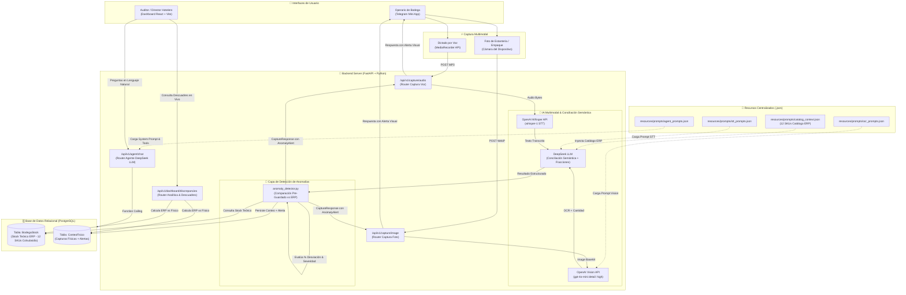

# Invictory_AI - Reto de Hotelería (Hackathon Colsubsidio x 30X)

**Invictory_AI** es una solución MVP de nivel empresarial diseñada para eliminar la captura manual de inventarios en almacenes y bodegas de hotelería mediante agentes de inteligencia artificial multimodal (**OpenAI Whisper** para voz, **OpenAI Vision `detail: high`** para OCR, **Detección de Anomalías Pre-Guardado en Tiempo Real** y **DeepSeek LLM `deepseek-chat`** con *Function Calling* sobre PostgreSQL y conciliación semántica).

---

## 📁 Gestión Centralizada de Prompts por Actor (`resources/prompts/`)

Para garantizar mantenibilidad, evolución continua y separar la lógica del software de las instrucciones de Inteligencia Artificial, **todos los prompts del proyecto están centralizados en archivos JSON** dentro de la carpeta `resources/prompts/`.

### 🎯 Arquitectura de Carga de Prompts

El módulo `backend/app/services/prompt_loader.py` lee dinámicamente cada archivo JSON en tiempo de ejecución. Esto permite que desarrolladores, prompt engineers y administradores editen las instrucciones de cualquier actor del sistema sin necesidad de modificar el código fuente Python ni recompilar la aplicación.

```text
resources/prompts/
├── catalog_context.json   # Actor: Catálogo ERP oficial & Reglas de Conciliación Semántica
├── stt_prompts.json       # Actor: Operario / Agente Speech-to-Text (Whisper + DeepSeek)
├── ocr_prompts.json       # Actor: Agente Vision OCR (OpenAI Vision gpt-4o-mini detail: high)
├── agent_prompts.json     # Actor: Agente Inteligente de Inventarios (DeepSeek LLM + DB Tools)
└── miniapp_prompts.json   # Actor: UI Operario Telegram MiniApp
```

### 📋 Detalle de Archivos de Prompts

1. **`catalog_context.json` (Contexto del Catálogo ERP):**
   ```json
   {
     "actor": "Contexto del Catálogo ERP de Colsubsidio (Inyección en Prompts de IA)",
     "catalogo_erp": [
       {"sku": "97503113", "articulo": "Caldero Recort Tapa 50x60 cm", "unidad": "Unidad", "bodega": "Stock Almacén Suministros"},
       {"sku": "95026919", "articulo": "Cazuela 16 Onz", "unidad": "Unidad", "bodega": "Stock Almacén Suministros"}
     ],
     "instrucciones_matching": "Mapea siempre el producto mencionado al artículo más cercano semánticamente..."
   }
   ```
2. **`stt_prompts.json` (Speech-to-Text con Conciliación Semántica y Fracciones):**
   ```json
   {
     "actor": "Operario de Bodega / Agente STT (Speech-to-Text)",
     "structured_extraction": {
       "system_role": "Eres un agente experto en inventarios de hotelería para Colsubsidio.",
       "prompt_template": "Extrae los datos dictados por voz, mapea contra el catálogo ERP {catalog} y convierte fracciones (medio kilo = 0.5)..."
     }
   }
   ```
3. **`ocr_prompts.json` (Vision OCR detail=high):**
   ```json
   {
     "actor": "Agente OCR Multimodal (Vision)",
     "vision_ocr": {
       "system_role": "Actúa como un OCR de máxima precisión para inventarios de hotelería.",
       "prompt_template": "Examina la imagen, mapea contra el catálogo ERP {catalog} y estima fracciones visibles en productos abiertos..."
     }
   }
   ```
4. **`agent_prompts.json` (Agente DeepSeek LLM sobre PostgreSQL):**
   ```json
   {
     "actor": "Agente Inteligente de Inventarios (DeepSeek LLM)",
     "system_instruction": "Eres el Agente Inteligente de Inventarios de Invictory_AI para la Hackathon Colsubsidio x 30X...",
     "tools": {
       "get_discrepancies_summary": "Obtiene el reporte consolidado de descuadres...",
       "search_product_stock": "Busca un producto o insumo específico en la base de datos...",
       "get_physical_counts_history": "Consulta el historial de capturas físicas de inventario..."
     }
   }
   ```
5. **`miniapp_prompts.json` (UI Telegram MiniApp):**
   ```json
   {
     "actor": "Operario Telegram MiniApp UI",
     "dictado_voz": { "guia_usuario": "Presiona grabar y dicta el conteo..." },
     "captura_foto": { "guia_usuario": "Toma una foto clara a la etiqueta, caja o estantería..." }
   }
   ```

---

## 📐 Diagrama de Arquitectura del Sistema (Mermaid)

El siguiente diagrama ilustra el flujo completo de información desde la captura por el operario, la inyección del catálogo ERP para **conciliación semántica**, la **detección de anomalías pre-guardado** en tiempo real, hasta la persistencia en PostgreSQL y la analítica en el Dashboard:



---

## ⚡ Características Principales (Diferenciadores Clave)

1. **🚨 Detección de Anomalías en Tiempo Real (Pre-Guardado):** Antes de persistir cualquier conteo, el servicio `anomaly_detector.py` compara la cantidad dictada u observada contra el stock teórico registrado en `BodegaStock`. Si la desviación supera el umbral configurado (`ANOMALY_THRESHOLD_PERCENT`), el sistema marca una alerta con severidad (`CRITICA`, `ALTA`, `MEDIA`) y solicita confirmación al operario.
2. **🧠 Conciliación Semántica Inteligente:** El catálogo ERP oficial de 12 SKUs (`catalog_context.json`) se inyecta dinámicamente en los prompts de IA. El LLM traduce la jerga de bodega (ej: *"ollas grandes"* → `"Caldero Recort Tapa 50x60 cm"`, *"cintas de empaque"* → `"Cinta Sellamiento 48 mm x 50 mts"`) mapeando exactamente a los artículos oficiales del sistema.
3. **📐 Manejo de Fracciones y Mermas:** El prompt instructivo interpreta fraccionamientos coloquiales (ej: *"medio kilo"*, *"una botella y media"*, *"quedó como un cuarto de bolsa"*) y los convierte a valores numéricos `float` precisos.
4. **🎙️ Captura Multimodal por Voz (Whisper-1 STT):** Transcripción rápida de dictados mediante OpenAI Whisper y estructuración JSON mediante DeepSeek LLM.
5. **📸 Captura Multimodal por Imagen (Vision OCR detail=high):** Inspección visual de etiquetas y empaques procesada por OpenAI Vision (`gpt-4o-mini`).
6. **🤖 Agente Inteligente DeepSeek con Function Calling (`/api/v1/agent/chat`):** Consultas interactivas sobre PostgreSQL en tiempo real con razonamiento en lenguaje natural.
7. **📊 Dashboard de Analítica de Descuadres:** Interfaz React con Corporate Innovation Framework que permite visualizar métricas KPI en formato Bento Grid, tabla detallada de descuadres y vistas híbridas.

---

## 📁 Estructura del Proyecto

```text
invictory_AI/
├── .env.example               # Variables de entorno sanitizadas (incluye umbrales de anomalía)
├── pyproject.toml             # Gestión de paquetes Python con uv y pytest
├── README.md                  # Documentación completa del proyecto con diagrama Mermaid
├── alembic.ini                # Configuración de migraciones de base de datos
├── alembic/                   # Versiones de migraciones PostgreSQL
├── resources/                 # 📁 Prompts Centralizados por Actor (.json)
│   └── prompts/
│       ├── catalog_context.json # Catálogo ERP oficial para conciliación semántica
│       ├── stt_prompts.json
│       ├── ocr_prompts.json
│       ├── agent_prompts.json
│       └── miniapp_prompts.json
├── docs/                      # Guías técnicas del reto y datos oficiales
│   ├── DESIGN .md             # Corporate Innovation Framework (Sistema de Diseño)
│   ├── colores.md
│   ├── ocr.md
│   ├── BODEGAS Y STOCK.xlsx
│   └── Cómo usar los recursos del reto Hotelería.docx
├── files/                     # Archivos reales de prueba para testing multimodal
│   ├── Record (online-voice-recorder.com).mp3
│   └── aceite_vegetal.webp
├── backend/                   # Servidor FastAPI + SQLAlchemy + Alembic
│   ├── app/
│   │   ├── main.py            # Entrypoint FastAPI
│   │   ├── config.py          # Configuración Pydantic Settings
│   │   ├── database.py        # Conexión directa a PostgreSQL
│   │   ├── models.py          # Modelos BodegaStock y ConteoFisico
│   │   ├── schemas.py         # Validadores Pydantic V2 (CaptureResponse, AnomalyAlert)
│   │   ├── services/          # Servicios STT, OCR, Detector de Anomalías y Prompt Loader
│   │   │   ├── prompt_loader.py
│   │   │   ├── stt_service.py
│   │   │   ├── ocr_service.py
│   │   │   ├── anomaly_detector.py # 🚨 Servicio de detección de anomalías pre-guardado
│   │   │   └── inventory_agent.py
│   │   └── routers/           # Routers /capture, /inventory, /dashboard y /agent
│   └── tests/                 # Pruebas unitarias y de integración (Pytest)
│       ├── conftest.py
│       ├── test_agent.py
│       ├── test_anomaly_detector.py # 🚨 8 escenarios de pruebas de anomalías
│       ├── test_inventory_unit.py
│       ├── test_capture_integration.py
│       ├── test_inventory_api.py
│       └── test_dashboard_api.py
├── miniapp/                   # Telegram Mini App (HTML5 + CSS + JS)
│   ├── index.html
│   ├── styles.css
│   └── app.js                 # 🚨 Renderizado de alertas visuales de anomalía en tiempo real
└── frontend/                  # Aplicación React + Vite + Vitest
    ├── package.json
    ├── vite.config.js
    ├── src/                   # Componentes, Páginas y Simulación MiniApp con alertas
    └── src/__tests__/         # Pruebas de componentes React (Vitest)
```

---

## 🚀 Guía de Ejecución

### 1. Configuración de Variables de Entorno
Copia el archivo `.env.example` a `.env` y configura tus API Keys:
```bash
cp .env.example .env
```

### 2. Migraciones de Base de Datos (PostgreSQL)
Ejecuta las migraciones de base de datos con Alembic:
```bash
uv run alembic upgrade head
```

### 3. Backend (FastAPI + `uv`)
Iniciar servidor FastAPI en el puerto `8080`:
```bash
# Sincronizar e instalar dependencias Python
uv sync

# Iniciar servidor FastAPI
uv run uvicorn backend.app.main:app --reload --port 8080
```
El servidor estará disponible en `http://localhost:8080` y la documentación interactiva en `http://localhost:8080/docs`.

### 4. Frontend (React + Vite)
En una nueva terminal, navega a `frontend/` y ejecuta en el puerto `5180`:

```bash
cd frontend
npm install
npm run dev -- --port 5180
```
La aplicación web React estará disponible en `http://localhost:5180`.

---

## 🧪 Ejecución de Pruebas (Backend y Frontend)

### Pruebas del Backend (Pytest)
Ejecuta las 20 pruebas unitarias e integración que validan endpoints, detector de anomalías (8 escenarios), agente DeepSeek y fixtures multimodales:

```bash
uv run pytest -v
```

### Pruebas del Frontend (Vitest)
Ejecuta las 7 pruebas de componentes e interfaz en React:

```bash
cd frontend
npm test
```

---

## 📊 Endpoints Clave

- `POST /api/v1/capture/audio`: Procesa dictado de voz mediante OpenAI Whisper STT + DeepSeek, inyecta catálogo ERP y retorna `CaptureResponse` con `AnomalyAlert`.
- `POST /api/v1/capture/image`: Procesa fotografía mediante OpenAI Vision OCR (`detail: high`), inyecta catálogo ERP y retorna `CaptureResponse` con `AnomalyAlert`.
- `POST /api/v1/agent/chat`: Consulta interactiva en lenguaje natural al **Agente DeepSeek LLM** con *Function Calling* sobre PostgreSQL.
- `GET /api/v1/dashboard/discrepancies`: Obtiene el reporte en vivo de descuadres y porcentaje de precisión.
- `POST /api/v1/inventory/seed`: Restablece el inventario semilla de 12 productos de prueba de Colsubsidio.

---

## 🏆 Créditos
Desarrollado para el **Reto de Hotelería** de la **Hackathon Colsubsidio x 30X**.
